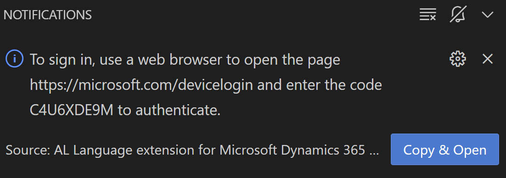
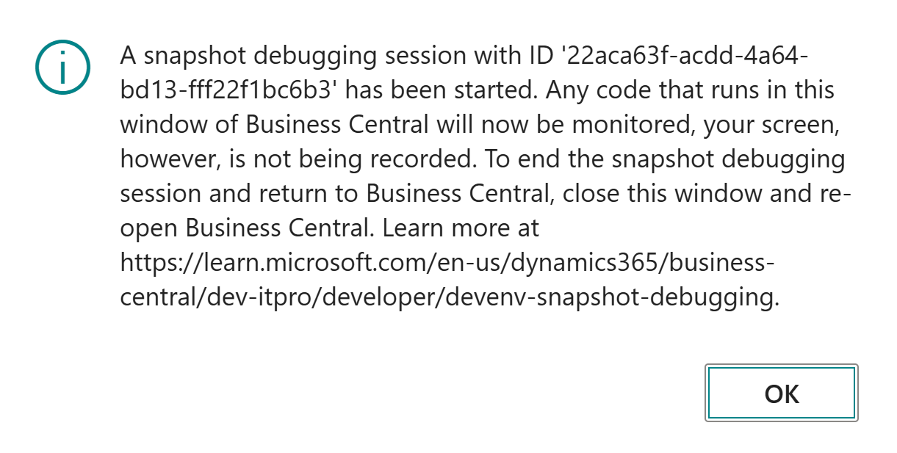

# Exercise 1: Setup and Run AL Profiler

In this exercise you will configure your `launch.json` file to run snapshot debugging sessions and capture snapshots of your sessions. Then you'll learn how to extract `.alcpuprofile` files from recorded snapshots, and analyze them using the AL Profiler tool.

## Task 1: Configure `launch.json` for Snapshot Debugging

1. Open the `launch.json` file in the `.vscode` folder of your project.
2. Click **Add Configuration** button.
3. From the list of options, choose **AL: Initialize a snapshot debugging session on cloud**
4. Change the `name` property to `Snapshot Debugging`.
5. Change the `environmentType` property to `Sandbox`.
6. Change the `environmentName` property to your sandbox environment name.
7. Define the `profilingType` property and set it to `Instrumentation`.

## Task 2: Start a Snapshot Debugging Session

1. Press `F7` to start snapshot debugging.
   * At this point, if this is the first time you are snapshot-debugging this environment, you will be prompted to sign in:
     
    * Click **Copy and Open** to open the URL in your browser and copy the displayed code to the clipboard.
    * Follow the instructions in the browser to sign into your environment.
2. To verify that a snapshot debugging session is started, click **View > Output** and then switch to AL output channel. There should be a message similar to the following
   ```
   The snapshot debugger initialize request for the debugging context '22aca63f-acdd-4a64-bd13-fff22f1bc6b3' has succeeded. 
   ```
3. In the browser, access the sandbox environment which you configured in the `launch.json` file. Make sure to start a new session and not reuse a previous one.
4. When you connect to your sandbox environment, there will be a message similar to this;
   
5. Click **OK** to start the snapshot debugging session.

## Task 3: Perform Actions in the Session

Here you may do anything you like. Perform a series of steps in Business Central that you are familiar with. For example, you could create a new sales quote, convert it to order, release the order, then post the shipment and invoice for it.

> Make sure to perform a series of actions, but do not overdo it. Four of five individual steps that invoke some process (such as posting) is enough.

## Task 4: Complete the Snapshot Recording

1. Back in VS Code, press `Alt+F7` to stop the snapshot debugging session.
2. The list of debug sessions is shown in the **The snapshot debug sessions** prompt:
   
3. Click the session you want to stop (there should be only one).
4. At this point, the session snapshot is being generated in the sandbox and downloaded to your local machine. This may take a little time. When downloading is completed, you will see a message similar to this in your AL output channel:
   ```
   The snapshot debugger attach session has finished. Snapshot successfully saved as 'd:\Workshops\BCPT\.snapshots\22aca63f-acdd-4a64-bd13-fff22f1bc6b3.zip'. 
   As the snapshot can contain customer privacy data, you should handle it according to privacy compliance and remember to delete it when you are done using it.
   Use the 'Show all snapshots' command, or by clicking the snapshot debugger icon in the left corner of the toolbar to view the downloaded snapshots ready for debugging.
   ```
5. There should be a new folder in your project called `.snapshots`. Inside this folder, you will find the downloaded snapshot file and a `snapshots.json` file that contains information about the snapshots.

## Task 5: Extract AL Profiler profile file from the snapshot

1. Press `Ctrl+Shift+P` (or `F1`) to open the command palette.
2. Enter *"AL: Generate profile file"*
3. In the **The snapshot debug sessions** prompt, select the session you just downloaded (there should be only one).
4. A notification will show with **Generating the profile output** message. Depending on how long your snapshot session was and how many tasks you performed, this may take a while.
5. When file is read, a new message will appear in your AL output channel:
   ```
   Profile file 'd:\Workshops\BCPT\.snapshots\22aca63f-acdd-4a64-bd13-fff22f1bc6b3.alcpuprofile' has been successfully generated.
   ```
   Also, the profile file will be created in your `.snapshots` folder and opened in AL Profiler inside VS Code.

## Task 6: Analyze the profile data

Use the profile file to try to answer these questions:
* Which function was called the most times
* Which function has the slowest own time
* How many different extensions were contributing the code to actions you called


To get familiar with AL Profiler functionality, you may use this link:

https://learn.microsoft.com/en-us/dynamics365/business-central/dev-itpro/developer/devenv-al-profiler-overview
